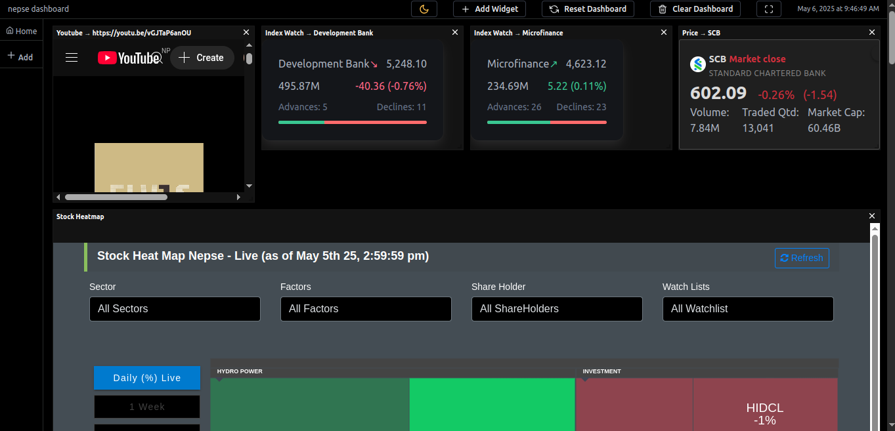
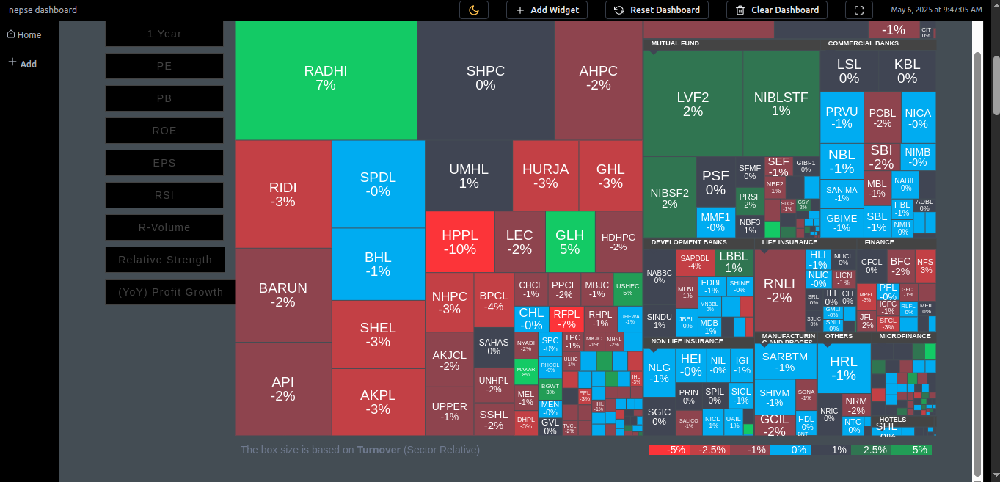
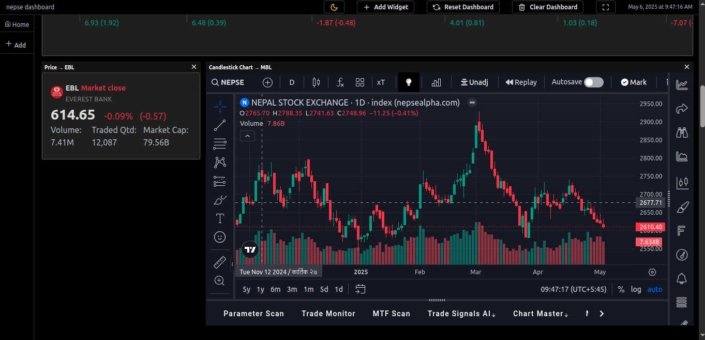
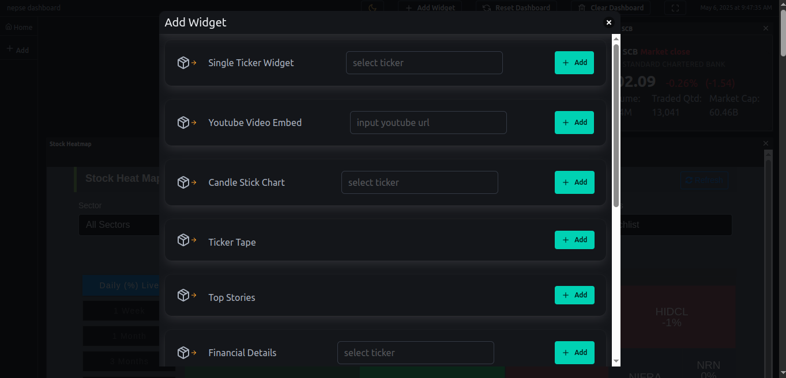
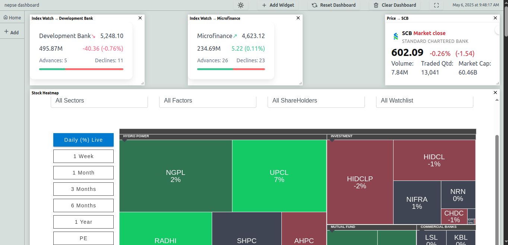

# Dashboard App Chrome/Firefox/Brave Extension

**Name:** Dashboard App  
**Description:** A dashboard app that provides widgets to add to your database, useful for NEPSE-based traders and investors.

## Installation Instructions (Development Mode)

To install the extension in development mode on Chrome, Firefox, Brave, or any Chromium-based browser, follow these steps:

### For Chrome / Brave:

1. **Download the source files:**  
   - Download the zip file of the extension from the [Releases section](#) or clone the repository using Git:  
     ```bash
     git clone https://github.com/yourusername/dashboard-app.git
     ```

2. **Extract the zip file (if needed):**  
   - If you downloaded a zip file, extract it to a directory of your choice.

3. **Screenshots (Optional):**  
   Here are some screenshots showcasing the features of the extension:
   - 
   - 
   - 
   - 
   - 

4. **Enable Developer Mode in Chrome/Brave:**
   - Open Chrome or Brave.
   - Go to the Extensions page by clicking on the three dots (menu) in the top-right corner > **More Tools** > **Extensions** or by navigating to:  
     ```
     chrome://extensions/
     ```
   - Toggle **Developer mode** in the top-right corner.

5. **Load the unpacked extension:**
   - Click the **Load unpacked** button.
   - Select the extracted extension folder (or the folder where you cloned the repo).

6. **Test the Extension:**
   - The extension should now be installed, and you should see it in the extension list.
   - Click on the extension icon to interact with it.

### For Firefox:

1. **Download the source files:**  
   - Download the zip file of the extension or clone the repository as mentioned above.

2. **Extract the zip file (if needed).**

3. **Screenshots (Optional):**  
   Here are some screenshots showcasing the features of the extension:
   - 
   - 
   - 
   - 
   - 

4. **Enable Developer Mode in Firefox:**
   - Open Firefox and go to the Add-ons page by navigating to:  
     ```
     about:debugging
     ```
   - Click on **This Firefox** and then **Load Temporary Add-on**.

5. **Load the unpacked extension:**
   - Select the `manifest.json` file inside the extracted folder.

6. **Test the Extension:**
   - The extension should be installed temporarily, and you should be able to test it.

## Features
- Widgets to add in your database
- Customizable dashboard for NEPSE-based traders and investors

## Contributing
Feel free to fork this repository and submit pull requests. We appreciate any help with improving the extension!

## License
This project is licensed under the MIT License - see the [LICENSE](./LICENSE) file for details.
